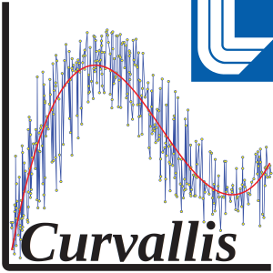

# 

# Curvallis

Curvallis is a plotting program written in Python 3 using MatPlotLib to visualize and modify experimental equation of state data. It does this by plotting individual isotherms as lines. Data can be either 1d or 2d, meaning there can be 1 or many isotherms plotted at once. Data points on these lines can be moved around, and new points can be added or removed. 1d data can have different equations fitted to them, which best fit the data. Some popular equations are currently Nth degree polynomials and Equations of State, but more exist and any equation can be added. Manipulating data points causes this fitted line to be recalculated and redisplayed. The manipulated data points, the fitted line, and calculated derivatives can be written to a file.

## Contents
 - [Curvallis](#curvallis)
 - [Contents](#contents)
 - [Installation](#installation)
 - [Virtual Python Environments](#virtual-python-environments)
 - [Running](#running)
 - [Options](#options)
    - [Optional arguments](#optional-arguments)
    - [Input arguments](#input-arguments)
    - [Output arguments](#output-arguments)
    - [Shift, Limit, and Point Exclusion arguments](#shift-limit-and-point-exclusion-arguments)
    - [View arguments](#view-arguments)
    - [Curve fitter arguments](#curve-fitter-arguments)
 - [Interactive Commands](#interactive-commands)
 - [Input Files](#input-files)
    - [1d Data](#1d-data)
    - [2d Data](#2d-data)
 - [Configuration File Syntax](#configuration-file-syntax)

## Installation

###### Note: `python` will refer to your python executeable, whatever it may be.

Curvallis has the following dependencies which need to be installed. These should be easilly installable through the setup program.

* matplotlib
* Tkinter
* numpy
* scipy
* argparse

######Scipy can be difficult to install, so it may have to be installed manually if the installer fails.

 The installer has been tested using Python v 3.6.9, Python v 3.8.1, and Python 3.8.5. The program itself **requires** Python 3.

To install this program, type `python setup.py` into a terminal in the directory containing 'setup.py'.
Run `python setup.py --help` for more instalation options.

For those adding features to Curvallis, there is a versioning system for automatically updating the version string of Curvallis when you commit changes. To enable or update this feature run `python setup.py --versioning`. You should only need to run the versioning setup once and the feature will be enabled for your local repository indefinitely, although you might want to rerun it occasionally for updates to versioning code.

## Virtual Python Environments

###### Note: `python` will refer to your python executeable, whatever it may be.

Virtual python environments are a great way to create new instances of python that are seperate from eachoter. Virtual python environments act just like a normal installation of python, except they are completely isolated from your systems main python installation. This separation means that the virtual environment has its own executable, pip package manager, and packages.

It is recommended to create a virtual python environment in the following circumstances:

 - When one wants to have a python program isolated from their main python installation
 - When there are two or more python programs that require conflicting packages or differing versions of the same package
 - When an isolated python environment is desired
 
 To set up a virtual environment, run `python venv_tools.py -c <location_to_create_virtual_environment>`.
 

## Running

Once installed, typing `curvallis` into a terminal should run the program at any location. The program can also be run if it's not installed. Just run `curvallis.py`. If you run the program this way, make sure you have manually installed all dependencies. 

To get started, the examples directory contains example configuration files and example data files. To test the configuration files, go to the examples directory and type `curvallis --config_file <config-file-name>`. Each config file has an explanation of what its commands are doing.

## Options

Options can be entered by either command line or initialization file. All options can be entered either way. The default initialization file is named curve_editor.ini, so the program will automatically read all arguments out of this file if it is in the same directory as the program is being run from. To read a different ini file, use the `--config_file` option. Command line arguments and ini files can be used simultaneously. If there are conflicting arguments, the command line arguments get priority. To input an option by command line, put `--<name> <value> <value> ...` For example to use the fit_type option type: `--fit_type poly5 poly4`. To input options using the ini file, don't include the dashes. If there are multiple values for the option, enclose them in brackets as well. You can also put "=" or ":" instead of a space between _name_ and _value_. More details about how configuration files work can be found in the "Configuration File Syntax" section in this document.

### Optional arguments
**Optional arguments** are options which aren't required to be given in order to run the program. This is either because there are default values or that option doesn't need to be specified at all. Options outside of this group may be optional as well, but these are the miscellaneous options which don't fit into another group. Here is a list of all options in this category:

   - **`-h`, `--help`**

   Shows all possible arguments along with a short description of what they do, then the program exits.

   - **`-v`, `--version`**

   Shows the program's version number, then the program exits.

   - **`--config_file <path>` (Default: curve_editor.ini)**

   Specify the configuration file path in "_path_". The default value is "curve_editor.ini", so if that file exists in the same directory as the program, it will be read.

   - **`--no_config_file`**

   Use this argument to ignore all config files. This is useful if the default config file is in the same directory as the program, but the user doesn't want to use it.

   - **`--background_file <path>` (Default: None)**

   Specify a background file to display. Background data is plotted, but is unchangeable.

   - **`--curve_output_file_name <path>` (Default: fit_curve_out.dat)**

   Specify the name of the fit curve output file. This file is written out by pressing "w" while the program is running. This file will only be written if `--fit_type` is specified as something other than "None". If the file already exists, it will be deleted and overwritten when the program is run.

   - **`--output_file_name <path>` (Default: moved_points_out.dat)**

   Use the file name "_path_" when writing out the moved data points for 1d data. This option doesn't have to be specified with 1d data because there is a default file name.

   - **`--pressure_file_name <path>` (Default: E2P.dat)**

   Use the file name "_path_" when writing out the calculated pressure curve for the inputted 1d data. This option doesn't have to be specified with 1d data because there is a default file name and is only used if the command line argument `--print_E2P` is used.

   - **`--bulk_mod_file_name <path>` (Default: P2B.dat)**

   Use the file name "_path_" when writing out the calculated bulk modulus curve for the inputted 1d data. This option doesn't have to be specified with 1d data because there is a default file name and is only used if the command line argument `--print_P2B` is used.

   - **`--bulk_mod_prime_file_name <path>` (Default: P2Bprime.dat)**

   Use the file name "_path_" when writing out the calculated bulk modulus prime curve for the inputted 1d data. This option doesn't have to be specified with 1d data because there is a default file name and is only used if the command line argument `--print_P2Bprime` is used.

   - **`--gamma_file_name <path>` (Default: Theta2Gamma.dat)**

   Use the file name "_path_" when writing out the calculated gamma curve (Gruneisen gamma) for the inputted 1d data. This option doesn't have to be specified with 1d data because there is a default file name and is only used if the command line argument `--print_theta2gamma` is used.

   - **`--points_per_decade <int>` (Default: 220)**

   Specify how many points per logarithmic decade should be given in the fit curve output file across the entire data set. If one wishes to increase the density of data points in the fit curve output file, simply increase the number given to this command line argument. NOTE: The data points in the fit curve output file are dispersed evenly on a logarithmic scale, not a linear scale.

   - **`--eos_function` (Default: all)**

   Allows the user to only plot a portion of a data file. 2d data files are separated into different sections. Each section is a different eos function, which the user can specify with this argument. Usual eos function names are "Ec", "Pc", "Cs", etc. By default, all sections are displayed.

   - **`--do_derivative`**

   Plot the derivative of the specified `--fit_curve` functions. Some derivative equations are questionable, so results may not be accurate. Unsure if this works with multiple fit types.

   - **`--do_integral`**

   Plot the integral of the specified `--fit_curve` functions. Some integral equations are questionable. Unsure if this works with multiple fit types.

   - **`--print_E2P`**

   Assume that the 1d data given is energy data and print out the corresponding pressure data into a file. This file name is set by the `--presure_file_name` command line argument.

   - **`--print_P2B`**

   Assume that the 1d data given is pressure data and print out the corresponding bulk modulus data into a file. This file name is set by the `--bulk_mod_file_name` command line argument.

   - **`--print_P2Bprime`**

   Assume that the 1d data given is pressure data and print out the corresponding bulk modulus prime data into a file. This file name is set by the `--bulk_mod_prime_file_name` command line argument.

   - **`--print_theta2gamma`**

   Assume that the 1d data given is Debye temperature data (theta data) and print out the corresponding Gruneisen gamma data into a file. This file name is set by the `--gamma_file_name` command line argument.

   - **`--region_bound <bound> <bound> ...`**

   Specify the boundaries of each region by its x value. Values may be int or float. The first and last boundary should not be specified because they are the first and last point of the data. The number of regions to create is calculated by the number of boundaries entered. 2 boundaries has 3 regions, 3 boundaries has 4, etc... For example, to create 3 regions with the first regions starting at the beginning of the data and ending at x=30, the second region starting at x=30 and ending at x=45, and the third region starting at x=45 and ending at the end of the data, you would enter `--region_bound 30 45`. Regions cannot overlap, so each boundary specifies the beginning of one region and the end of another. 
   **This option is NOT able to be used in conjunction with the `--region_data_points` option.**

   - **`--region_data_points <int>`**

   Specify that regions should automatically be made based upon how many data points each region should hold. Regions will be created with the given number of data points in each region, starting from the left/beginning of the data, until the end is reached. If there is a region at the end of the data without the sufficient number of data points, it will be combined with the previous region. For example, if the parameter `--region_data_points 40` is given when plotting a data file of 209 data points, region boundaries would be created between the 40th and 41st, 80th and 81st, 120th and 121st, and the 160th and 161st data points. A region boundary is not created between the 200th and 201st data points because this would leave only 9 points in the last region. 
   **This option is NOT able to be used in conjunction with the `--region_bound` option.**

   - **`--overlap <int>` (Default: 2)**

   Specify how many points to overlap on region edges for calculating fitted curves. Regions themselves can't overlap, but points in other regions can be used for fitting so that fit curves align better at boundary areas. If there aren't enough points in a region for the overlap, the total number of points in that region will be used instead.

   - **`--numpoints <int>` (Default: 5)**

   Specify the number of points to use to find averages for tri-local smoothing. This number must be odd, not even. Press "_shift_ Z" while running the program to smooth the data.

   - **`--repeat <int>` (Default: 10)**

   Specify how many times to repeat tri-local smoothing each time "_shift_ Z" is pressed while the program is running.

   - **`--matchpt <float>` (Default: -1)**

   Specify the matchpoint for integral smoothing. This is in the form of an x-value. The default is "-1", or rather not to use a matchpoint.

   - **`--interp <arg>` (Default: cubic)**

   Specify the interpolator for integral smoothing. Options can be found under the "Kind" parameter on the [SciPy Documentation Page](https://docs.scipy.org/doc/scipy/reference/generated/scipy.interpolate.interp1d.html).

   - **`--angle <int>` (Default: 90)**

   Specify the angle to use for acute repair smoothing. The smoother will remove any angles less than this value in degrees.

   - **`--minimum_points_per_region <int>` (Default: 0)**

   Set the minimum number of points that should be written out per region when saving fit curve.

### Input arguments
**Input arguments** specify different input data sources. Exactly one must be specified.

   - **`--in_eos_file_base <base path>`**

   Read in source data points specified by "_base path_" from 2d, 3 column eos data (contains more than one isotherm). Do not include the file extension in the name. If this option is set, `--out_eos_file_base` must be set as well.

   - **`--input_file <path>`**

   Read in the input file specified by "_path_" for source data points. Use this only for 1d, 2 column data.
 
   - **`--parabola_in`**

   Use an internal noisy input parabola as the source data. Used for developer testing.

   - **`--predefined_in`**

   Use the internal predefined data as source data. Used for developer testing.

### Output arguments
**Output arguments** specify where changed data is written to. Use only one of these.

   - **`--out_eos_file_base <base path>`**

   Use the file name "_base path_.dat" when writing out the moved data points for 2d, eos data. 
   **This option must be set if `--in_eos_file_base` is set.**

### Shift, Limit, and Point Exclusion arguments
**Shift, Limit, and Point Exclusion arguments** alter the appearance of input data. None of these options are required to be set.

   - **`--decimate <count>`**

   Only displays "_count_" points of the inputted data. If the data is 1d, there will be "_count_" total data points. If the data is 2d, each line will have "_count_" number of points. The points will be equally distributed across the span of the original data, so the result is nearly the same as using the `--step` option, which is described below.

   - **`--step <step>`**

   Only use every "_step_th" point. For example, `--step 3` uses every third point. When writing out points with `--step` set, the points not shown are still included in the written file.

   - **`--t_step <step>`**

   Only use every "_step_th" isotherm. Each isotherm is its own line, so every "_step_th" line in the input file is skipped. The skipped isotherms are still included if the moved points are written out.

   - **`--x_include <low> <high>`, `--xinclude <low> <high>`**

   Only display input points between the x values "_low_" and "_high_". Other points aren't plotted, but will be included when writing out the moved points.

   - **`--x_scale <scale> <low> <high>`, `--xscale <scale> <low> <high>`**

   Multiply the x value of each input point by "_scale_" if "_low_" < x < "_high_". 

   - **`--x_shift <shift> <low> <high>`, `--xshift <shift> <low> <high>`**

   Add "_shift_" to the x value of each input point where "_low_" < x < "_high_".

   - **`--y_include <low> <high>`, `--yinclude <low> <high>`**

   Only display input points between y values "_low_" and "_high_". Other points aren't plotted, but will be included when writing out the moved points.

   - **`--y_scale <scale> <low> <high>`, `--yscale <scale> <low> <high>`**

   Multiply the y value of each input point by "_scale_" if "_low_" < x < "_high_".

   - **`--y_shift <shift> <low> <high>`, `--yshift <shift> <low> <high>`**

   Add "_shift_" to the y value of each input point where "_low_" < x < "_high_".

   - **`--t_include <low> <high>`, `--tinclude <low> <high>`**

   Only display input points in isotherms with values between "_low_" and "_high_".

   - **`--v_axis`**

   Use "v" as the x axis instead of "rho". When using this option fit curves will not fit the data correctly. This essentially makes x = 1/x for each input point.

### View arguments
**View arguments** determine what starts out displayed on the screen. For example, "x_max" could be set to 200 when the data extends to 2000 and the default view will be from the minimum data point to 200. If only some of these options are set, the others are determined by the minimum and maximum x and y values of the data.

   - **`--x_max <num>`**

   Set the maximum x value for the window.

   - **`--x_min <num>`**

   Set the minimum x value for the window.

   - **`--y_max <num>`**

   Set the maximum y value for the window.

   - **`--y_min <num>`**

   Set the minimum y value for the window.

### Curve fitter arguments
**Curve fitter arguments** select and parameter the curve fitter formulas. The main options here are "fit_type" and "refine_fit", which specify which equations are fitted to the data. Most other options are coefficient guesses for the equations. Sometimes, the algorithm which attempts to fit equations to the data fails because it can't find a good fit. If the user has an estimate as to what the value a certain coefficient in the equation should equal, the guess options will allow them to enter that, and the algorithm will have a better chance of finding a good fit. Guess arguments take floating point numbers.

   - **`--fit_type <fit> <fit> ...` (Default: poly5)**

   Select an equation to fit to the data points for each region. For example, if you have three regions, `--fit_type none poly5 birch3` would set no equation for the first region, "poly5" for the second region, and "birch3" for the third region. Regions are ordered from smallest to greatest x value. If a fit type is not specified for any region, then the default "poly5" equation will be used. This means if there are five regions, but only three fit types, the the last two regions will be set to "poly5".
   The available equations are:
> anton, ap1, ap2, bardeen, birch2, birch3, birch4, ebirch3, ebirch4, emurnaghan, evinet, johnson, kumari, log, log2, murnaghan, none, poly1, poly2, poly3, poly4, poly5, poly6, poly7, poly8, poly9, poly10, poly11, poly12, sandiapc, shank, vinet, highp.

Options starting with an "e" are energy equations, "poly<b>n</b>" are nth degree polynomials, and the rest are pressure. Only some of these equations have been thoroughly tested to check if they work properly. 
    These are:
> birch2, birch3, birch4, ebirch3, ebirch4, emurnaghan, evinet, murnaghan, none, all polys, vinet.
 
 When inputting this argument in a configuration file, make sure to enclose all options in brackets.

   - **`--refine_fit <fit> <fit> ...` (Default: none)**

   Fits a second equation to the existing fit type in order to more closely fit the data. It accomplishes this by taking the error between the data points and the fit type, and fitting another equation to the error. This new equation is then added to the original fit type. This argument works the same as `--fit_type`. An equation must be selected for each region. This means if the region the user wants to add a refine fit to a region that isn't the first region, a refine fit must be specified for all regions before it. For example, if the user wants to add a refine fit to the third region, but no other regions, they would type `--refine_fit none none poly5`. If there are more than three regions, the rest of the regions will be specified "none" by default. 
   Available equations are:
> poly1, poly2, poly3, poly4, poly5, poly6, poly7, poly8, poly9, poly10, poly11, poly12, eseries4, eseries5, eseries6, eseries7, eseries8, eseries9, eseries10, eseries11, eseries12, eseries (same as eseries7), none, highp.

   - **`--delta_p_guess <float>`**

   Set an initial guess for the bulk modulus. This is another name for `--k0_guess`. They both do the same thing.

   - **`--k0_guess <float>`**

   Set an initial guess for the bulk modulus. This is another name for `--delta_p_guess`. They both do the same thing.

   - **`--k0_prime_guess <float>`**

   Set an initial guess for the derivative of bulk modulus.

   - **`--k0_prime_prime_guess <float>`**

   Set an initial guess for the second derivative of bulk modulus.

   - **`--lam_guess <float>`**

   Set an initial guess for lambda.

   - **`--rho0_guess <positive float>`**

   Set an initial guess for equilibrium density (rho0) or fixed guess if using the fitter "sandiapc".

   - **`--scale_derivative_by <float>` (Default: 1000)**

   Scaling factor for derivative plot.

   - **`--scale_second_derivative_by <float>` (Default: 1000)**

   Scaling factor for second derivative plot.

   - **`--scale_integral_by <float>` (Default: 0.001)**

   Scaling factor for integral plot.

   - **`--xref <float>` (Default: 0)**

   Set a reference x value to determine the integration constant for the integral plot.

   - **`--y_axis 
`**

   Choose pressure (P) or energy (E) for the y axis for the integral plot.

   - **`--yref <float>` (Default: 0)**

   Set a reference y value to determine the integration constant for the integral plot.

   - **`--e0_guess <float>`**

   Set an initial guess for energy (E0).

   - **`--theta0_guess <float>`**

   Set an initial guess for theta (theta0).

   - **`--gamma0_guess <float>`**

   Set an initial guess for gamma (gamma0).

## Interactive Commands

**Interactive commands** can be inputted while the plotter is running. When using these commands, make sure the display's focus is on the plotting window and not the terminal. If these commands are entered while focus is on the terminal, nothing will happen. Also make sure the cursor is in the plotting window. If it isn't, nothing will happen. Some of these commands can also be triggered by the buttons on the bottom left of the plotting window screen. Commands with an asterisk next to them are defaults from the "matplotlib" library and their functionality could change depending on the version of "matplotlib" installed. See the [matplotlib documentation](https://matplotlib.org/3.2.1/users/navigation_toolbar.html#navigation-keyboard-shortcuts) for more information on these default commands.

   - **q, _ctrl_ w\***

   Quit the program. Press "q" once and the program will ask the user to confirm. Press "q" a second time to quit, or any other key to cancel quit.

   - **f\*, _ctrl_ f\***

   Toggle full screen mode.

   - **h\*, r\*, _home_\***

   Reset the screen to the default limits. This is usually how the screen starts originally, but if log scale has been toggled, the screen will default back to how it first looked after toggling log scale. Also triggered by the leftmost button on the bottom left of the screen.

   - **c\*, _left_\*, _backspace_\***

   Set the screen back to the previous view. The view can be changed by zooming or panning. Also triggered by the second to leftmost button on the bottom left of the screen.

   - **_right_\*, v\***

   Set the screen to the next view. This only works if the user had set the screen to the previous view before this. Also triggered by the third to leftmost button on the bottom left of the screen.

   - **p\***

   Toggle panning the screen. When in pan mode, the mouse cursor changes to a hand, and the user can move the screen by clicking and dragging. Also triggered by the fourth to leftmost button on the bottom left of the screen.

   - **o\***

   Toggle zoom mode. When in zoom mode, the mouse cursor changes to a cross, and the user can zoom on a rectangular region by clicking on one corner, and dragging the mouse to the opposite corner of that region. Also triggered by the fifth to leftmost button on the bottom left of the screen.

   - **g\***

   Toggle minor grids.

   - **s, _ctrl_ s\***

   Save the current figure as a ".png" image. This feature does not work correctly. It will display all manipulations the user made to the data. Also triggered by the rightmost button on the bottom left of the screen.

   - **k\*, L\***

   Toggle x log scale on the graph.

   - **l\***

   Toggle y log scale on the graph.

   - **t**

   Toggle the original line on and off. The line will look the same as the movable line unless the user has moved or added points.

   - **b**

   Toggle hiding point markers. The line itself will still be displayed.

   - **w**

   Writes the changed data points to a file whose name is set by the `--output_file_name` option. If the data is using a fitted curve, another file will be written out containing the points of the fitted curve with a name set by the `--curve_output_file_name` option. Using command line options which limit the amount of data displayed, such as "step" or "include", will not affect which points are written out. These files need to be moved or renamed before running the program again or they will be overwritten.

   - **y**

   Toggle x movement on or off when manipulating points. The default for 1d data is off and the default for 2d data is on. Moving the cursor along the x axis while moving a point will not allow the point to move in the x direction if this mode is enabled.

   - **a**

   Toggle Add/Remove Mode. Once in Add/Remove mode, the terminal prints that Add/Remove mode has been enabled. Left clicking adds a point at the location of the mouse pointer, and right clicking removes a point at the location of the mouse pointer if there is a point close by.

   - **e**

   Toggle selecting a block of points to modify. Once this has been toggled on, the user can drag their mouse over a region of points to select them. Then, by left clicking and dragging, the user can move the block of points around. Right clicking and dragging will rotate the block of points. A region of points must be selected to apply automatic smoothing algorithms like tri-local smoothing. This mode will stay active on the current selection of points until the user left clicks away from the block of points, or presses 'e'. The terminal will print that the mode has been disabled.

   - **u**

   Undo the last data manipulation. This includes moving points, rotating points, adding points, and removing points. This does not undo screen changes, like zooming or panning. This will only undo the last change, no more previous changes are stored.

   - **F1**

   Displays a list of all the interactive commands, as well as a quick description of what each does.
   
   - **m**
   
   Displays a list of all of the fitter information for each region.

   - **i**

   Increases the size of the figure/plot margins. This is usefull if the numbers labelling an axis are so large they go off the screen. This is the opposite of the "_shift_ I" interactive command.

   - **_shift_ I**

   Decreases the size of the figure/plot margins. This is the opposite of the "i" interactive command.

   - **_shift_ H**

   Increase the size of the background markers. These background markers are placed when a file is given as an input to the `--background_file` optional argument.

   - **_shift_ J**

   Decrease the size of the background markers. These background markers are placed when a file is given as an input to the `--background_file` optional argument.

   - **_shift_ Q**

   Pop up a window to enter an equation to plot. Equations must be entered using Python syntax. For example, "x^2" doesn't work, you have to use either "x\**2" or "pow(x,2)". Check the [Python Math library](https://docs.python.org/3/library/math.html) to see a list of available math related functions to use. To plot the entered equation, press the "Plot" button. To remove the plotted equation, press the "Delete" button. If the user wants to plot multiple equations, pressing "_shift_ Q" will continue to open new windows to plot more equations. After closing a window, the equation plotted from that window is deleted. After plotting an equation, the user can write the points to a file by specifying a file name in the "Filename" Entry and clicking "Write". The equation must be plotted and a file name must be specified before any points will be written.

   - **_shift_ Z**

   Smooth data using tri-local smoothing. The user must select a region to smooth by pressing "e" and selecting a rectangular region.

   - **_shift_ X**

   Smooth data using integral smoothing. This smoother is unreliable unless the user specifies a good matchpoint with the `--matchpt` option. Otherwise, the smoother outputs error messages. The user must select a region to smooth by pressing "e" and selecting a rectangular region.

   - **_shift_ B**

   Smooth data using B-spline smoothing. The user must select a region to smooth by pressing "e" and selecting a rectangular region.

   - **_shift_ V**

   Smooth data using acute repair smoothing. The user must select a region to smooth by pressing "e" and selecting a rectangular region.

## Input Files

There are two different types of input files accepted. One type only plots a single line (1d data), while the other type plots multiple lines of data (2d data). Different arguments must be used to read the different types of input data, and the format of the data is different between the two types. The types' styles, formats, and differences are explained below.

### 1d Data

1d data files plot a single line. Single line data can include a fit type, which is an equation fitted to the data and displayed by a red line. The default fit type is a fifth degree polynomial, but the argument `--fit_type none` will specify no equation. 1d data also allows the user to add and remove points from the line. Use the `--input_file` argument to read in 1d data. 1d data and 2d data can't be read in at the same time since only one input file can be read. To specify the name of the output file of moved points, use the argument `--output_file_name`. The default name is "moved_points_out.dat". 1d data files are very simple to write because they are only two columns of data. The data can be integers or floating point values. The space between the columns can be any length. Lines can be ignored for comments by typing a "#" before the data. Here are some examples of correct data:
 
    #This is a comment

    5 5

    5.3455         7.678

    #Scientific notation can be used as well

    2.874444E+02  5.67E-03

### 2d Data

2d data files plot multiple lines. They are more specific in format than 1d data. 2d data doesn't allow the argument `--fit_type` nor the ability to add or remove points. Only existing points can be modified. Use the `--in_eos_file_base` option, followed by the name of the input file, to read in an input file. The user is required to specify an output file name for moved points as well. To do this, use the `--out_eos_file_base option`. There is no default name, which is why this option must be specified when reading in 2d data. To start a 2d data file, you must specify an eos function (section name), the number of isotherms in that eos function (number of lines in the section), and the number of data points in each isotherm/line, which looks something like this: 

Pc 100 95 

This example line means the section name is "Pc", there are 100 isotherms in this section, and there are 95 data points in each isotherm. The amount of spacing between the elements on this line doesn't matter. A line like this will always be the first line of the file. There will be a line like this at the start of every new section of the file as well. All isotherms in a section must have the same number of data points. Here is some example data: 

    Pc 2 2

    1 3.4 7.77

    1 4.4 6.23

    2 3.4 13.6

    2 4.4 15.9

    Ec 2 2

    1.34 3.4 67.8

    1.34 4.4 69.007

    3.45 3.4 4.44

    3.45 3.4 -12.4

In this example, there are two sections: "Pc" and "Ec". Both sections have 2 isotherms, and each isotherm in the section has two data points. Each data point has three values. All three values can be represented just like 1d data (integer, floating point, scientific notation, etc.). The first value is the value of the isotherm/line. This value isn't plotted, and is used instead to differentiate between isotherms in the section. In the example above in the "Pc" section, the first isotherm value is "1", and the second is "2". These values don't have to be integers or in order. Isotherms can have any value, as long as it is different from any other isotherms in that section. In the "Ec" section, the first isotherm is "1.34", and the second is "3.45". The other two values on the line are the x and y values of that data point. Just like 1d data, the amount of spacing doesn't matter between values on a line. One reason to divide data into sections is to be able to plot only one section of it. To do this, use the option `--eos_function` followed by the section name (also known as the "eos function name"). If some sections of your data file are 1d data, it will work as well. Afterwards there will only be two columns of data. The 1d data must be in its own section, however, and include a proper section line. A correct 1d section within a 2d data file looks something like this:
 
    Ec 1 5

    1 3.4

    2.3 4.5

    3.3 7.65

    4.4 2.11

    6.7 3.44

## Configuration File Syntax

Some format details:

- \# in any column starts a comment

- ; in any column starts a comment (.ini style)

- --- in the FIRST column starts a comment (.yaml style)

These all set "name" to value. "name" is the command-line option, without the leading "--". The key is case sensitive: "Name" is not "name". Examples:

- name value

- name = value   # (.ini style)  (white space is ignored, so name = value same as name=value)

- name: value    # (yaml style)

- --name value   # (argparse style)

These all set "name" to "True". "=", ":", and "--" work similarly:

- --name

- name

- name True

- name true

To specify an argument with multiple values or with a type of "list":

- fruit = [apple, orange, lemon]

- fruit: [apple, orange, lemon]

- indexes = [1, 12, 35 , 40]

- indexes: [1, 12, 35 , 40]

.ini-style section names are treated as comments:

- [section]

### Example Configuration File

See "[examples/config-complete-list.ini](examples/config-complete-list.ini)" for an example configuration file.
